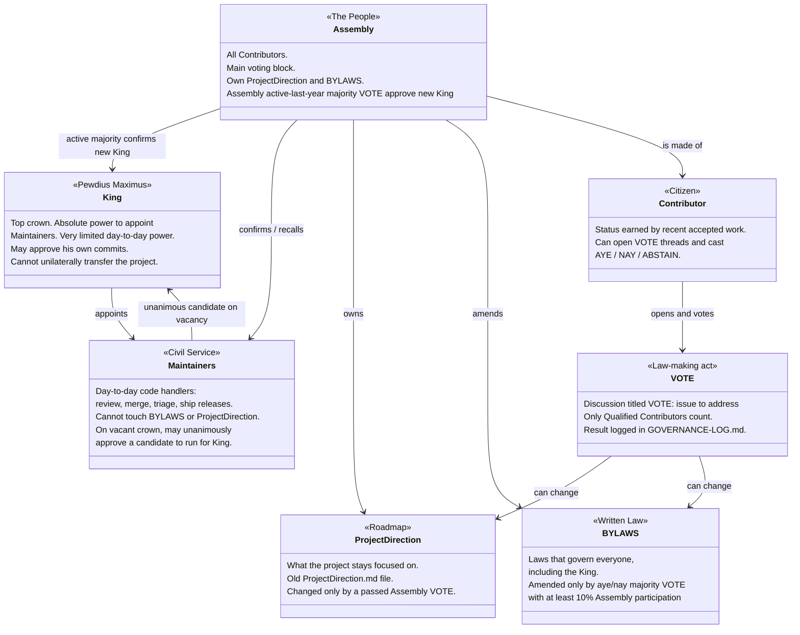

# Odysseus Project Bylaws

**Version 0.1 - DRAFT for community ratification**

## Preamble

Short written constitution. Three coequal parts: King, Maintainers, Assembly.
No roadmap or law change is valid unless it follows this file.

## Powers at a glance

---

## 1. King - Pewdius Maximus

**Summary:** Holds the crown. Strong appointment power. Weak day-to-day power.

1. The King appoints Maintainers.
2. The King may approve his own commits.
3. The King does **not** set ProjectDirection.
4. The King does **not** edit these Bylaws alone.
5. The King **cannot** unilaterally transfer the project or name a successor who takes power.

---

## 2. Maintainers - Civil Service

**Summary:** Day-to-day code handlers. No law. No roadmap.

1. Duties: review, merge, triage, releases, and carrying out passed direction.
2. Maintainers **cannot** edit `BYLAWS.md` or `ProjectDirection.md` except through a passed Assembly VOTE.
3. Maintainers are appointed only by the King.
4. Recall: Assembly may remove a Maintainer by the vote rules in Section 5.
5. On a vacant crown only, Maintainers may **unanimously** approve a candidate to run for King.

---

## 3. Assembly - The People

**Summary:** Main voting block. Owns direction and law.

1. The Assembly is all **Qualified Contributors**.
2. The Assembly owns `ProjectDirection.md`.
3. The Assembly amends these Bylaws by aye–nay majority VOTE, with at least 10% of the Assembly casting AYE, NAY, or ABSTAIN.
4. The Assembly approves any new King candidate by majority of votes cast by contributors active in the last year (accepted work in the last year).
5. The Assembly may hold a VOTE to request the King add or remove a Maintainer.
6. Only the Assembly turns a proposal into binding project law.

---

## 4. Contributor - Citizen

**Summary:** Status is earned by work, not gifted.

1. Contributor status is earned by recent accepted work.
2. A Contributor may open VOTE threads.
3. A Contributor may cast:
   - AYE (smiling eyes emoji)
   - NAY (confused emoji)
   - ABSTAIN (eyes emoji)

---

## 5. VOTE - How Law Is Made

**Summary:** Public Discussion thread. Two-click reactions. Logged or invalid.

1. Every Assembly decision runs as a GitHub Discussion titled:
   `VOTE: [short description]`
2. The opening post must state:
   - exact proposal text
   - vote type (`simple`, `direction`, or `bylaws`)
   - open and close time (UTC)
   - pass threshold
3. Contributors react on the opening post only: AYE, NAY, ABSTAIN
4. Only reactions from Contributors count.
5. Default rules:
   - **Simple** (address, close, open, work on, or resolve an open project issue): 7 days, aye–nay majority, you cannot vote on your own proposal.
   - **Direction** (changes to ProjectDirection): 14 days, aye–nay majority, you cannot vote on your own proposal.
   - **Bylaws** (changes to this file): 14 days, aye–nay majority among votes cast, at least 10% of the Assembly must cast AYE, NAY, or ABSTAIN.
6. Final tally is posted in the thread and written into `GOVERNANCE-LOG.md` within 30 days.
7. Maintainers may not edit, delete, or lock a VOTE thread except for the reasons below. Any action under this rule must be explained in public in the thread. A VOTE thread may be closed only if:
   1. **Not qualified** - opened by a non-contributor. Autoclose.
   2. **Wrong format** - title/body missing required VOTE fields, or not a real proposal. Autoclose or request fix, then close if unfixed.
   3. **Spam / scam** - ads, malware, floods, bot spam, or repeated junk. Autoclose.
   4. **Hostile or abusive** - rude language, personal attacks, harassment, hate, threats, or bad-faith hostility aimed at people rather than the proposal. Autoclose.
   5. **Illegal or unsafe** - doxxing, private personal data, or content that creates clear legal/safety risk. Autoclose.
   6. **Duplicate** - exact same open proposal already in an active VOTE. Close the newer one, link the original.
   7. **Any other reason** - a Maintainer must post a **close-proposal comment** in the thread. That mini-vote runs **2 hours**, aye–nay majority, proposer cannot vote on their own close proposal. Close only if it passes. If it fails or times out with no majority, the VOTE stays open.

## 7. ProjectDirection - Roadmap

**Summary:** What the project focuses on.

1. `ProjectDirection.md` is the roadmap.
2. It is owned by the Assembly.
3. It changes **only** through a passed `direction` VOTE.
4. It sets review priority for Maintainers: commits and work matching current ProjectDirection are reviewed first.

---

## 8. Bylaws - Written Law

**Summary:** Laws that govern everyone, including the King.

1. These Bylaws govern everyone, including the King.
2. They are amended only by aye–nay majority VOTE, with at least 10% of the Assembly casting AYE, NAY, or ABSTAIN.
3. They are owned/amended by the Assembly.

---

## 9. Transparency

**Summary:** If it is not public, it is not law.

1. Governance happens in public repo channels.
2. Private chats are social/ops only. They cannot set direction or amend law.
3. Appointments, recalls, VOTE results, and succession acts are appended to `GOVERNANCE-LOG.md`.

---

## 10. Ratification

**Summary:** Live when the vote ends passed.

1. These Bylaws take effect automatically when a `bylaws` VOTE passes and its timer runs out.

---

**End of Bylaws**
